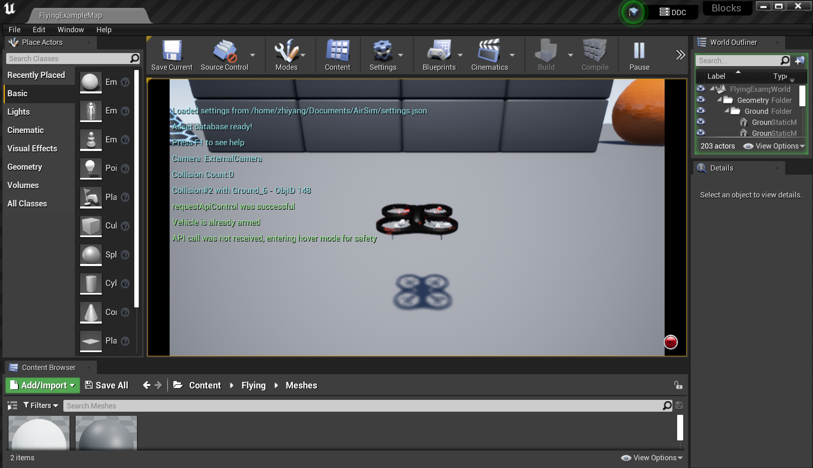
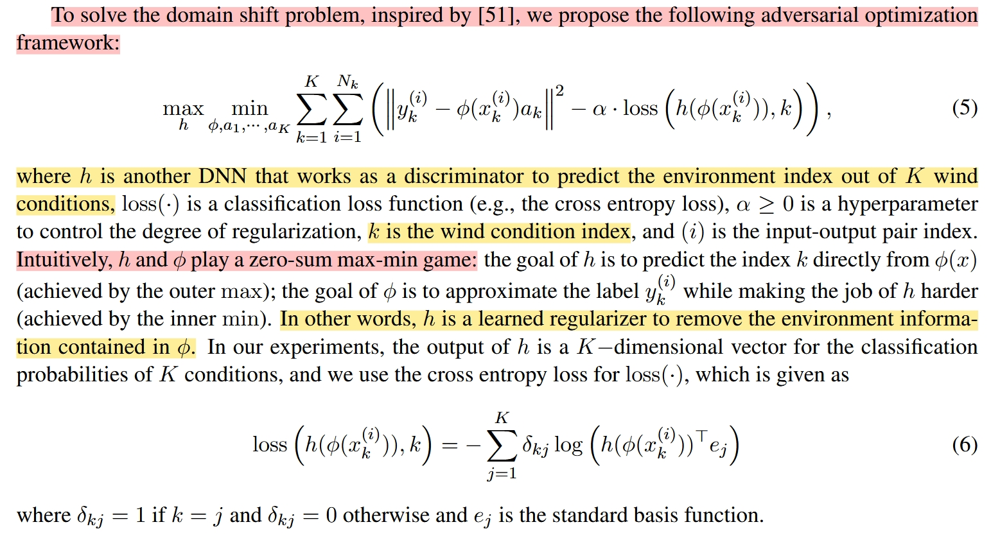
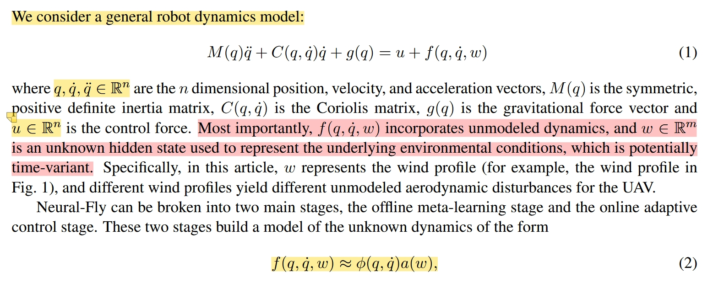
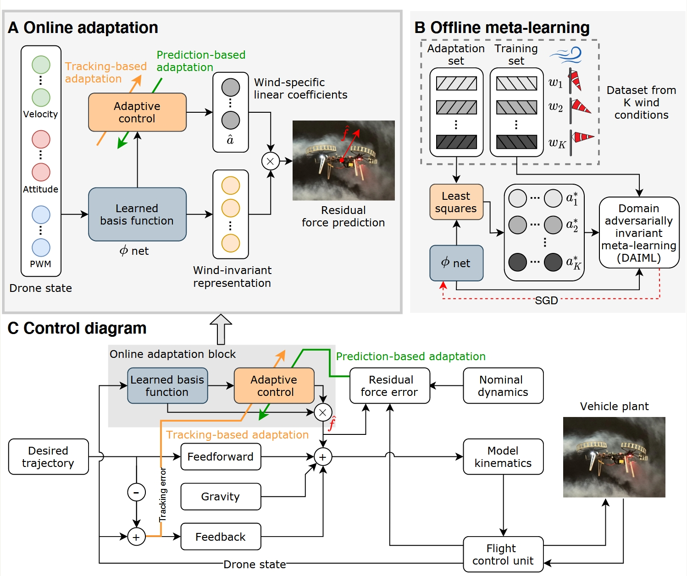
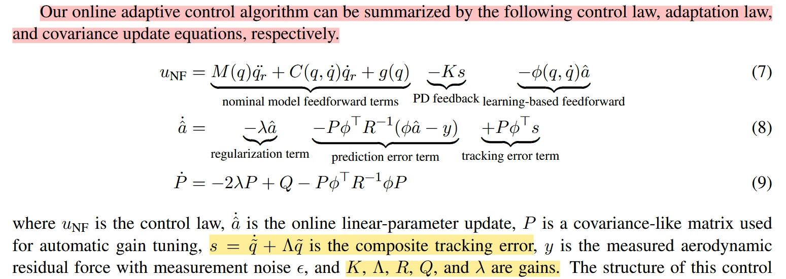
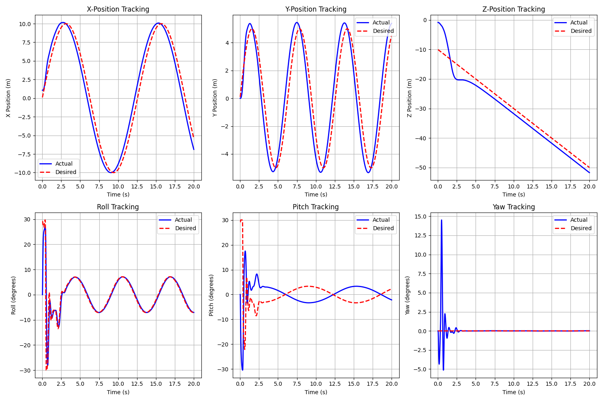
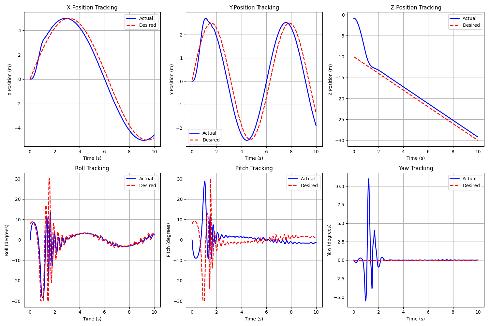

<h1>Neural-Fly Reproduction</h1>

Zhiyang Zhou

Original paper:

**Neural-Fly enables rapid learning for agile flight in strong winds** https://arxiv.org/abs/2205.06908

## Scripts

|Filename|Description|
|---|---|
|`training-and-validation.ipynb`|Domain Adversarially Invariant Meta Learning (DAIML) algorithm, the offline learning process for Neural-Fly. This script trains a wind-invariant representation of the aerodynamic effects on a quadrotor. After training the model, some simple statistics and plots are generated which show the model performance fitting to the training and testing data. |
|`run_in_airsim_adaptive.py`|Running in airsim using adaptive control|
|`run_in_airsim_phi.py`|Running in airsim using Phi network|

## Get started

Reference: https://microsoft.github.io/AirSim/build_linux/

1. Register with Epic Games and link it with Github. 

2. Check out 4.27 and download zip (git clone takes too muck time)

3. Follow this guide if you use ubuntu 22.04 https://blog.csdn.net/weixin_58660639/article/details/147927822

4. After starting Unreal, choose blocks environment -> advanced options -> convert inplace

5. Put settings.json under ~/Documents/Airsim

```
{
  "SettingsVersion": 1.2,
  "SimMode": "Multirotor",
  "Vehicles": {
    "Drone1": {
      "VehicleType": "SimpleFlight",
      "AutoCreate": true
    }
  }
}
```

6. Click play

7. Run python code

<div style="text-align: center;">
  
</div>

## Paper details

### 1.Input and labels (page 8)

**Inputs** (velocity, attitude quaternion, and motor speed PWM command)

+ `vx, vy, vz`
+ `quaternion`, not sure wxyz or xyzw
+ rotor speed get from `getRotorStates() / 1000`

**Label** (offline calculation of aerodynamic residual force)

+ `residual force` = actual force - nominal force

### 2.Phi Network

**structure**(page 23)

The output channel has 4 dimension(3 + 1bias), and is multiplied by linear coefficients (ax,ay,az which is also R4) to get 3 channels.

In `training-and-validation.ipynb` [block3] the output dimension is 3 which is wrong.

**loss function**(page 18)

zero-sum max-min game



**training**(page 19)

'(i) The adaptation step (Line 4-6) solves an least squares problem as a function of φ on the adaptation set Ba. (ii) The training step (Line 7) updates the learned representation φ on the training set B, based on the optimal linear coefficient a∗ solved from the adaptation step. (iii) The regularization step (Line 8-9) updates the discriminator h on the training set.'


### 3.Dynamics (page 16)

`q` is a 3 dimension vector



### 4.Control Diagram (page 4)

<!--  -->
<div style="text-align: center;">
  
</div>

<br>

**controller design**(page 20)



### 5.Implementation (page 9)

'We implemented our control algorithm and the baseline control methods in the position control loop in Python, and run it on the onboard Linux computer at 50 Hz. The PX4 was set to the offboard flight mode and received thrust and attitude commands from the position control loop.'


## Results

### Added baseline -- traditional adaptive control

*Actual position go ahead of desired, which is strange.*



### Neural-fly

*still debugging*



## Todo

+ check the calculation of desired roll & pitch
+ check the order of quaternions
+ add wind......

## Code details

line56: define neural_fly_controller

+ line73: calculate velocity and acceleration with one-order euler method
+ line82: control parameters
+ line90: calculate tracking error s
+ line119: use phi network
+ line144-165: controller update
+ line179: calculate desired thrust and angle

line225: class AirSimNeuralFlyController
+ line358: define run_simulation

line515: main loop

line539: desire trajectory


## Dataset filenaming scheme

Filenames are structured as

    <VEHICLE>_<TRAJECTORY>_<METHOD>_<CONDITION>.csv

For specific details please refer to the article.

| Field | Description |
| --- | --- |
| `<VEHICLE>` | <li>`custom`: drone built using consumer off-the-shelf components with PX4 flight controller</li><li> `intel`: Intel-Aero RTF Drone, used for data collection for Neural-Fly-Transfer controller |
| `<TRAJECTORY>` | <li>`random3`: randomized trajectory created by randomly sampling 2 waypoints and generating a smooth spline from the current position through both waypoints; continuous derivatives through snap </li><li> `random2`: similar to `random3` except only one random waypoint is generated</li><li> `figure8`: a lemniscate trajectory given by <ul> `(x(t),y(t),z(t)) = (1.25 * sin(t), 0, 0.75 * sin(2 * t)` |
| `<METHOD>` | <li>`'baseline'`: nonlinear baseline control </li><li> `'indi'`: incremental nonlinear dynamics inversion control </li><li> `'L1'`: L1 adaptive control </li><li> `'NF-C'`: Neural-Fly-Constant, our adaptive controller without any learning </li><li> `'NF-T'`: Neural-Fly-Transfer, our learning based adaptive control with the ML model trained on data from the Intel-Aero drone </li><li> `'NF'`: Neural-Fly, our learning based adaptive control with the ML model trained on data collected with the custom drone , </li> |
| `<CONDITION>` | wind condition for experiments, where the number corresponds to the fan array duty cycle and converts to <ul><li>`nowind` = 0 m/s</li><li>`10wind` = 1.3 m/s</li><li>`20wind` = 2.5m/s</li><li>`30wind` = 3.7 m/s</li><li>`35wind` = 4.2 m/s</li><li>`40wind` = 4.9 m/s</li><li>`50wind` = 6.1 m/s</li><li>`70wind` = 8.5 m/s</li><li>`70p20sint` = 8.5+2.4sin(t) m/s</li><li>`100wind` = 12.1 m/s</ul>

## Experiment data

Additionally, the data from the experiment results present in the paper is provided. To load the data, run the following in python

    import utils
    Data = utils.load_data(folder='data/experiment')

This will load all of the experiment data as a list of dictionaries. The `i`th experiment, field `field`, at the `j`th timestep, can be accessed with `Data[i][field][j]`. Most fields are ndarrays except the metadata fields, pulled from the filename. Available fields are given in the following table.

| `field` | description |
|---------|-------------|
| `'t'` | time in seconds |
| `'p'` | position vector in meters |
| `'p_d'` | desired position vector in meters |
| `'v'` | velocity vector in m/s |
| `'v_d'` | desired velocity in m/s |
| `'q'` | attitude represented as a unit quaternion |
| `'R'` | rotation matrix (body frame to world frame) |
| `'w'` | (this is a misnomer - should be $\omega$) angular velocity in rad/s |
| `'T_sp'` | thrust setpoint sent to the flight controller |
| `'q_sp'` | attitude command sent to the flight controller |
| `'hover_throttle'` | throttle at hover computed as a best fit function of the battery voltage |
|  '`fa'` | aerodynamic residual force computed using numerical differentiation of `v` and `T_sp`, `q`, and `hover_throttle` |
| `'pwm'` | motor speed commands from the flight controller |
| `'vehicle'` | `<VEHICLE>` field from filename |
| `'trajectory'` | `<TRAJECTORY>` field from filename |
| `'method'` | `<METHOD>` field from filename |
| `'condition'` | `<CONDITION>` field from filename |
