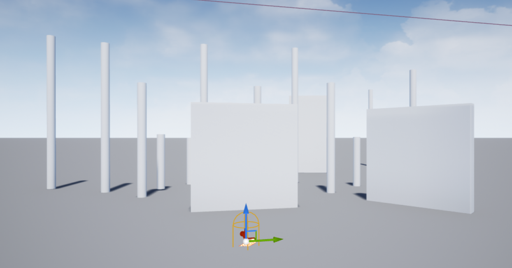
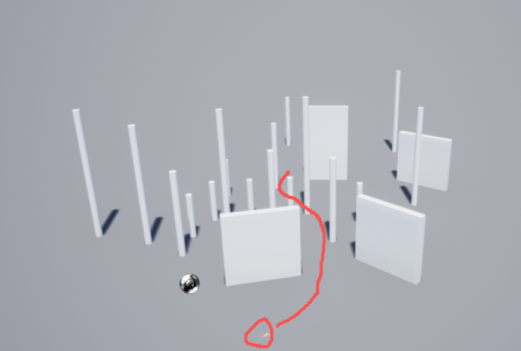
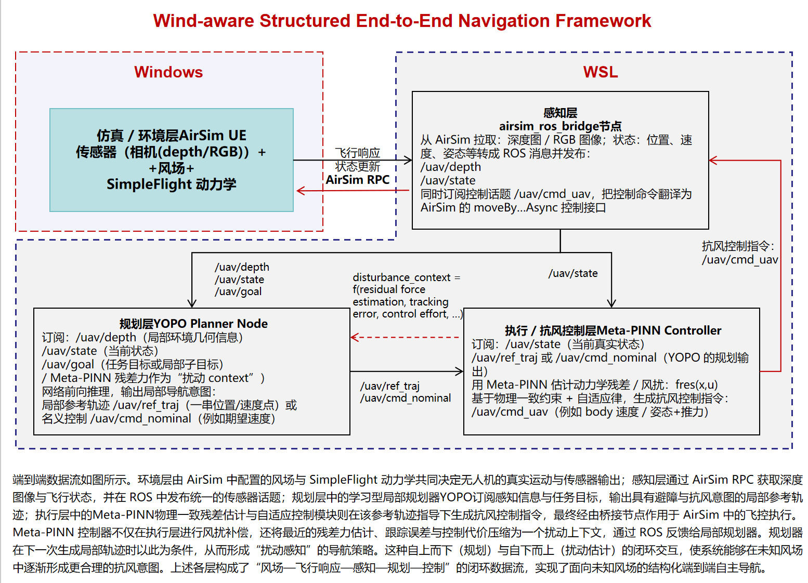

# Wind-aware Structured End-to-End Navigation Framework

## Logs
### 2026.1.28
+ airsim_yopo_runner.py在密集障碍中避障
+ 障碍物分布如下图



### 2026.1.15

+ 修改了ploy_solver.py中的calculate_yaw函数，控制偏航角的效果更好，但还不是很好
+ 调试pd参数可以使用test_yaw_controller.py
+ 可以实时打印深度图像，log增加欧拉角输出
+ 当障碍物在视野中间时，决策会左右来回跳，最终撞上障碍物，也可能是回正太早，修改calculate_yaw中的weight

### 2026.1.4

+ yopo_airsim.py 跑通，纯py方案
+ TODO：修改仿真场景验证避障功能，改控制器
### 2025.12.31

+ neural-fly-airsim folder deleted. to find it, clone https://github.com/my-zzy/neural-fly-airsim
+ 暂时抛弃windows-wsl通信方案，转为纯windows+python方案

## TODO:

1. Windows(Airsim) - WSL(YOPO) 数据传输
2. Airsim中的仿真数据发布 ros topic, 适配YOPO
3. YOPO生成的轨迹通过话题给controller, 适配meta-pinn



```
YOPO/
├── yopo_airsim.py          ← Main entry (run this)
├── requirements.txt        ← Updated (no ROS deps)
├── train_yopo.py           ← Keep for training
├── yopo_trt_transfer.py    ← Keep for TensorRT (optional)
├── config/
│   ├── __init__.py
│   ├── config.py
│   └── traj_opt.yaml
├── policy/
│   ├── __init__.py
│   ├── poly_solver.py
│   ├── primitive.py
│   ├── state_transform.py
│   ├── yopo_network.py
│   ├── yopo_dataset.py     ← Only for training
│   ├── yopo_trainer.py     ← Only for training
│   └── models/
│       ├── backbone.py
│       ├── head.py
│       └── resnet.py
├── loss/                   ← Only for training
└── saved/
    └── YOPO_1/
        └── epoch50.pth
```

## Windows(Airsim) - WSL(YOPO) 数据传输搭建步骤如下：

1. wsl中使用python3的ros环境（不要使用conda 下的python3）：  
终端 1（WSL，系统 ROS）  
`source /opt/ros/noetic/setup.bash`  
`roscore`  

2. 终端 2（WSL，系统 ROS，先“清理环境”）  
`unset PYTHONPATH`  
`unset PYTHONHOME`  
`export PATH=/usr/bin:/bin:/usr/sbin:/sbin`  
`source /opt/ros/noetic/setup.bash`  
`roslaunch rosbridge_server rosbridge_websocket.launch`  

3. 终端 3（WSL，YOPO）  
`source /opt/ros/noetic/setup.bash`  
`source ~/anaconda3/etc/profile.d/conda.sh`  
`conda activate yopo`  
`python test_yopo_ros.py`  

4. 在windows启动Airsim+UE，然后运行python airsim_yopo_bridge.py  （windows下的python环境），输出：  
`[INFO] Connected to rosbridge`  
`Connected!`    
`Client Ver:1 (Min Req: 1), Server Ver:1 (Min Req: 1)`  
`[INFO] Connected to AirSim`  
`[INFO] Listening to /yopo/cmd_vel`  
说明YOPO+AirSim已经调通  


### settings.json

```
{
  "SettingsVersion": 1.2,
  "SimMode": "Multirotor",

  "RpcEnabled": true,
  "RpcServerPort": 41451,
  "LocalHostIp": "0.0.0.0",
  
  "ViewMode": "FlyWithMe",

  "Vehicles": {
    "Drone1": {
      "VehicleType": "SimpleFlight",
      "AutoCreate": true,
      "Cameras": {
        "0": {
          "X": 0.5,
          "Y": 0.0,
          "Z": -0.1,
          "Pitch": 0,
          "Roll": 0,
          "Yaw": 0,
          "CaptureSettings": [
            {
              "ImageType": 0,
              "Width": 160,
              "Height": 96,
              "FOV_Degrees": 90
            },
            {
              "ImageType": 3,
              "Width": 160,
              "Height": 96,
              "FOV_Degrees": 90
            }
          ]
        }
      }
    }
  },

  "Weather": {
    "Enable": true
  }
}

```